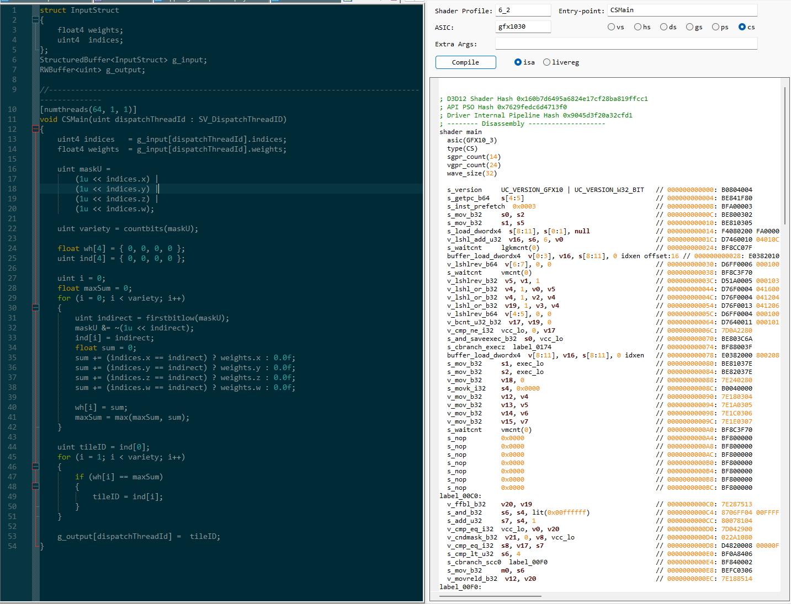

# NppRgaIsaPlugin
Notepad++ plugin for compiling HLSL to ISA

**NppRgaIsaPlugin** is a Notepad++ plugin that displays the assembler ISA code of a compiled HLSL shader in a separate dockable panel.  
Compilation is performed via `rga.exe` (Radeon GPU Analyzer) in DX12 mode directly to ISA (without intermediate SPIR-V).

  

## 🚀 Features
- Displays compiled HLSL ISA code.
- Two modes: ISA code and ISA live registers.
- Minimalistic ASM syntax highlighting.

## 🛠️ Installation
1. Copy `NppRgaIsaPlugin.dll` into your Notepad++ folder: `plugins/NppRgaIsaPlugin/`.
2. Restart Notepad++.
3. Open the panel via **Plugins → RGA ISA Compiler → ISA Panel**, or click the toolbar icon.
4. Set the path to your installed `RadeonDeveloperToolSuite` via **Plugins → RGA ISA Compiler → RGA Path**.

## 🧩 Dependencies
- Notepad++ Plugin SDK  
- Scintilla headers (included in SDK)

## 📄 License
[MIT License](LICENSE)